<h1 align="center" style="font-family: 'Orbitron', sans-serif;">Origin Esports CRM</h1>

<p align="center">
  A powerful CRM platform for managing esports fans, merchandise sales, news, teams, and discussions, built with <b>Laravel 11</b> and <b>Tailwind CSS</b>.
  The users for the system are mainly two sets: the fans of the esports organization and the administration staff running the platform. 
  Fans can either browse the platform, shopping catalog, view details about the org, and event details without signing up, or sign up to access more features. 
  The site management (administrator) users will manage the site, keep merchandise inventories updated, update the org details, view analytics, handle customer support tickets, and more.
</p>

---

## Features

- **Fan Management**: Keep track of fans, their interests, and engagement.
- **News and Updates**: Post and share the latest news and content with fans.
- **Team Pages**: Showcase information about your esports teams.
- **Forums and Discussions**: Engage with fans through interactive forums.
- **Merchandise Shop**: Sell and manage esports merchandise.
- **Shopping Cart**: Buy and save esports merchandise into personal carts.
- **Sponsor Management**: Highlight team sponsors and their contributions.

---

## Tech Stack

- **Backend**: [Laravel 11](https://laravel.com/)
- **Frontend**: Tailwind CSS, Alpine.js
- **Database**: MySQL
- **Tools**: Jetstream, Livewire, Laravel Forge for hosting

---

## Screenshots

### Homepage
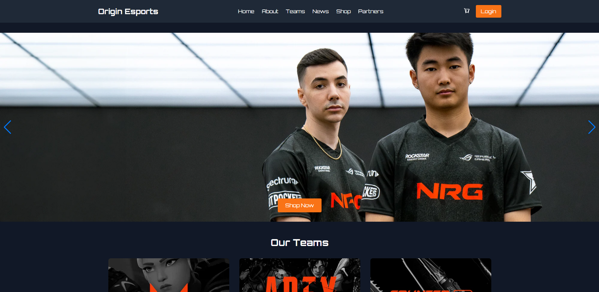
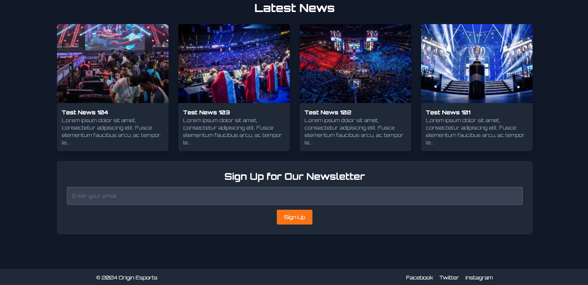

### Shop Section
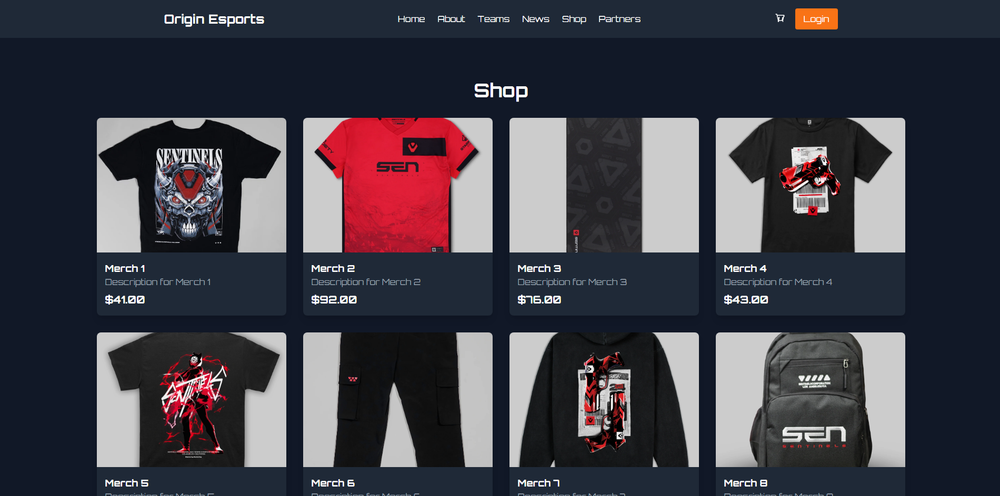
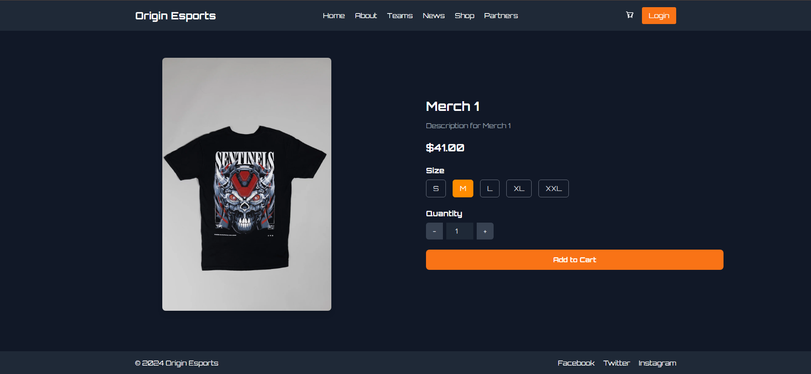
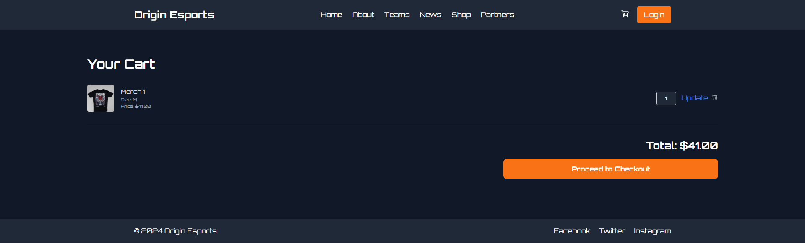

### Team Pages
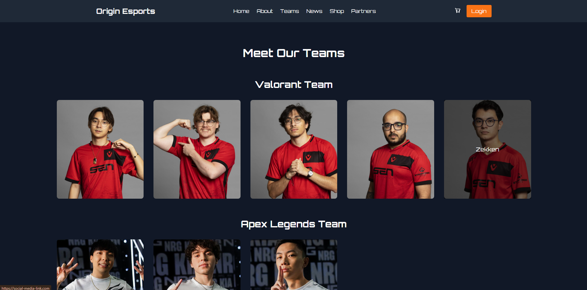

### News Section
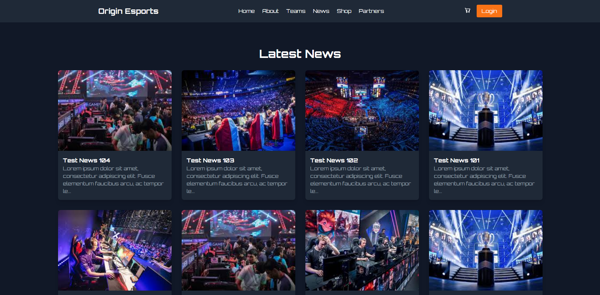

### Admin Dashboard
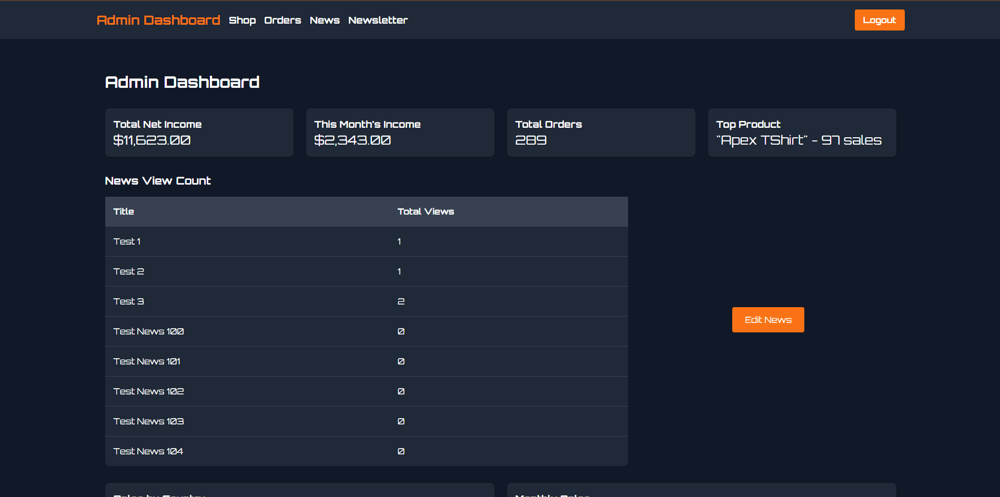
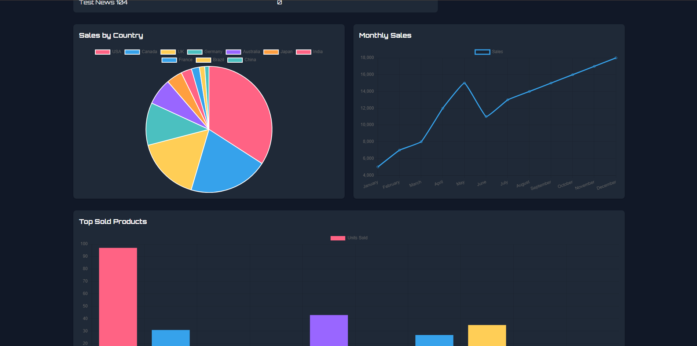

### Admin Shop Management
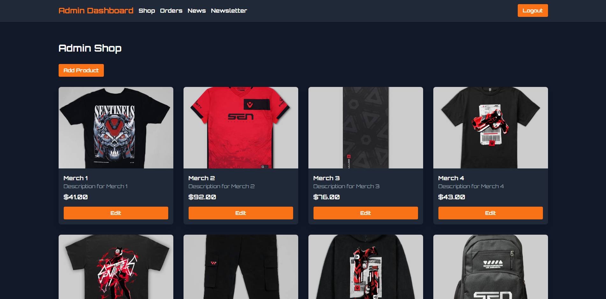

### Admin News Management
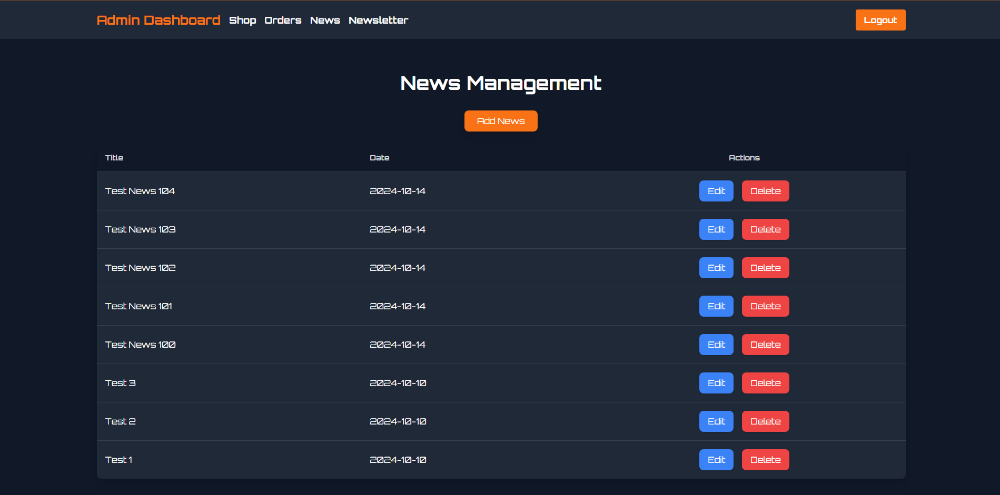
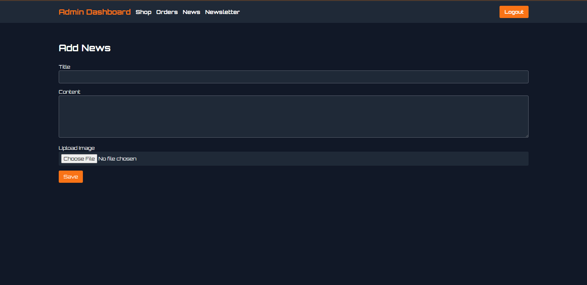

---

## Installation

```bash
git clone https://github.com/OsuraHansaja/Origin-eSports-CRM.git
cd Origin-eSports-CRM
composer install
npm install
cp .env.example .env
php artisan key:generate
php artisan migrate --seed
npm run dev
php artisan serve
